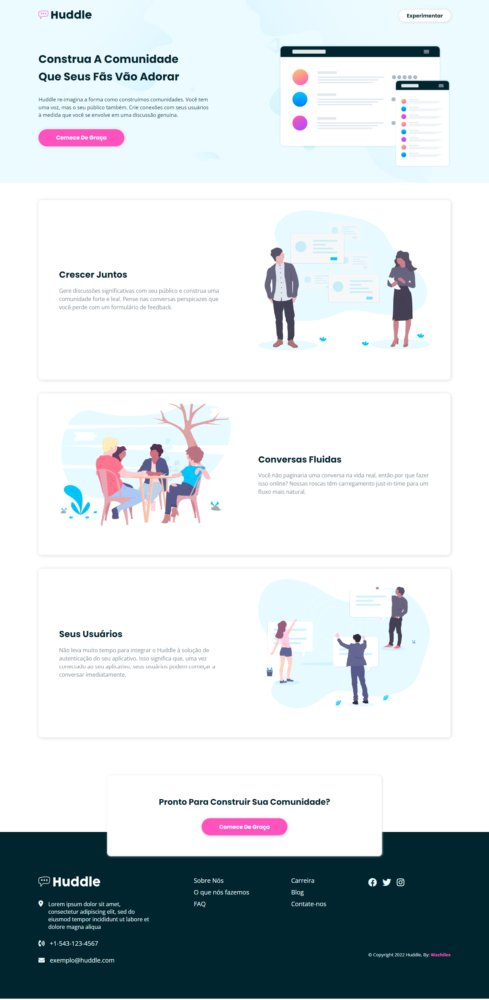

# Frontend Mentor - Huddle landing page with alternating feature blocks solution

This is a solution to the [Huddle landing page with alternating feature blocks challenge on Frontend Mentor](https://www.frontendmentor.io/challenges/huddle-landing-page-with-alternating-feature-blocks-5ca5f5981e82137ec91a5100). Frontend Mentor challenges help you improve your coding skills by building realistic projects. 

## Table of contents

- [Overview](#overview)
  - [The challenge](#the-challenge)
  - [Screenshot](#screenshot)
  - [Links](#links)
- [My process](#my-process)
  - [Built with](#built-with)
  - [What I learned](#what-i-learned)
  - [Useful resources](#useful-resources)
- [Author](#author)

## Overview

### The challenge

Users should be able to:

- View the optimal layout for the site depending on their device's screen size
- See hover states for all interactive elements on the page

### Screenshot

### Links

- Solution URL: [Click Here!](https://www.frontendmentor.io/solutions/huddle-landing-page-ptbr-html-css-sass-MNZ7uL3wg-)
- Live Site URL: [Click Here!](https://wat-huddle.vercel.app/)

## My process

### Built with

- Semantic HTML5 markup
- CSS custom properties
- Flexbox
- Mobile-first workflow
- [SASS](https://sass-lang.com/) - For styles

### What I learned

This challenge was really good for me to practice my layout skills.

### Useful resources

- [Font Awesome](https://fontawesome.com/) - This helped me for icons.

## Author

- GitHub - [Wachiles](https://github.com/wallacycaike)
- Frontend Mentor - [@wachiles](https://www.frontendmentor.io/profile/wallacycaike)